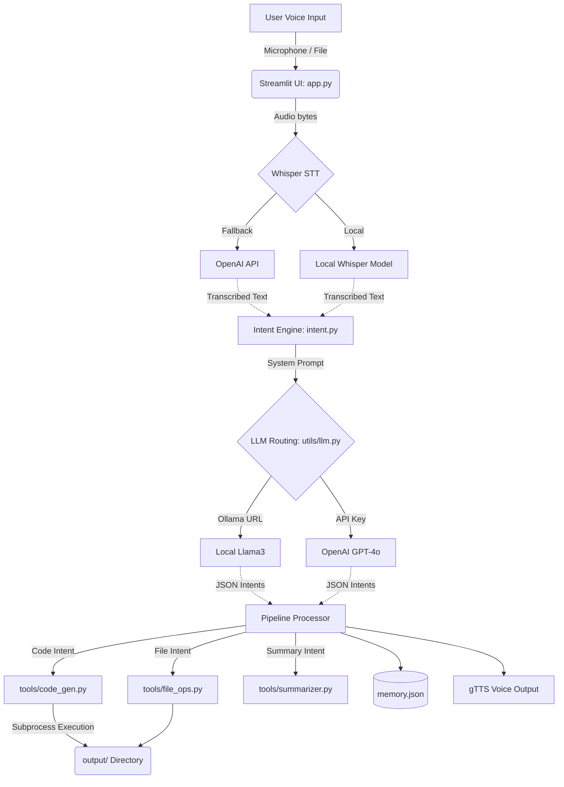

# 🎙️ Voice-Controlled AI Agent

## 📌 Project Overview
The **Voice-Controlled AI Agent** is an enterprise-grade Streamlit application that acts as a secure, local-first intelligence assistant. It listens to voice commands, transcribes them using OpenAI Whisper, understands multi-step intents simultaneously via LLMs (OpenAI or Ollama), and autonomously performs tasks. 

These tasks include generating code, executing Python scripts, summarizing text, and managing files. Security and isolation are prioritized: all outputs are safely generated within an isolated `output/` directory, destructive actions require explicit human confirmation, and remote code execution can be disabled via environment variables.

## 🏗️ Architecture & Data Flow



## 🛠️ Design Decisions (Assignment Notes)
This project was designed with professional Software Engineering principles:
- **Clean Architecture & SOLID:** The UI module (`app.py`) focuses strictly on presentation and state management, deferring logic to self-contained services (`utils/` and `tools/`).
- **Robust Error Handling:** All errors are captured generically via a centralized Python `logging` instance instead of using bare `print()` statements, providing audit trails in `app.log`.
- **Type Safety:** The entire codebase utilizes standard Python type hinting (`List`, `Dict`, `Optional`) to prevent runtime mismatches and build stronger intellisense.
- **Security:** Arbitrary Python execution is protected behind the `ALLOW_CODE_EXECUTION` environment flag. If deploying the app publically via Docker, this is disabled by default to prevent Remote Code Execution (RCE) attacks.

## 🚀 Setup Steps

1. Clone the repository:
   ```bash
   git clone https://github.com/Somyasharmatech/Voice_Agent_Mem0.git
   cd Voice_Agent_Mem0
   ```
2. Create and activate a Virtual Environment (Recommended):
   ```bash
   python -m venv venv
   # Windows
   venv\Scripts\activate
   # Mac/Linux
   source venv/bin/activate
   ```
3. Install Dependencies:
   ```bash
   pip install -r requirements.txt
   ```
4. **Environment Variables**:
   Copy the example environment file and configure your keys.
   ```bash
   cp .env.example .env
   ```
   *Edit `.env` to add your OpenAI API Key or change the Ollama endpoint.*

5. Optional: If using Ollama, ensure Ollama is installed and running `llama3` locally (`ollama run llama3`).

## ▶️ Application Usage
Start the Streamlit application using:
```bash
streamlit run app.py
```
Open your browser to `http://localhost:8501`.

## 🧪 Testing
The application uses `pytest` to guarantee subsystem reliability. To run the automated unit tests, simply execute:
```bash
pytest tests/
```

## ⚠️ Limitations
- **Transcription Time**: Using local Whisper without a GPU can be slow. A fallback API integration strategy is outlined in `stt.py` if needed.
- **Execution Safety**: While disabled by default in cloud deployments, local code execution enforces a timeout but lacks containerized sandboxing. Never run generated code that interfaces with critical system features blindly.
